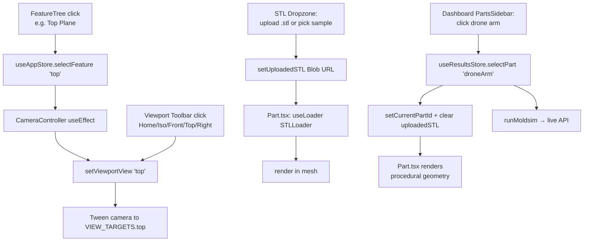

# Architecture

VITYA is a Next.js 16 (App Router, Turbopack) + React 19 + Zustand SPA with a moldsim simulation layer co-located as Next API routes. No separate backend.

## Route map

```
/                                  workspace (CAD-style editor; gated behind mock auth)
/results                           MoldLocal dashboard (live moldsim, multi-part library)
/analysis/costing                  cost breakdown + drivers
/analysis/draft                    draft-angle DFM
/analysis/thickness                wall thickness + cooling + flow
/analysis/undercut                 undercut detection + side-action cost
/analysis/on-demand                supplier readiness + quote modal

/api/ai/chat                       POST → OpenAI chat completion
/api/moldsim/cost                  POST → cost estimation
/api/moldsim/cooling               POST → cooling time + cycle time
/api/moldsim/filling               POST → flow analysis
/api/moldsim/manufacturing         POST → DFM check (the headline "score")
/api/moldsim/materials             GET  → material database
/api/moldsim/density               POST → density / specific volume
/api/moldsim/viscosity             POST → Cross-WLF viscosity
/api/report                        GET  → PDF report via react-pdf
```

## Two Zustand stores

```mermaid
flowchart LR
  subgraph useAppStore["useAppStore"]
    A1[isAuthenticated]
    A2[features / suggestions / parameters]
    A3[viewportState<br/>view, tool, grid, heatmap, zoom]
    A4[uploadedSTL, currentPartId]
    A5[simulationParams / simulationResults]
    A6[chatMessages, isAiThinking]
  end

  subgraph useResultsStore["useResultsStore"]
    R1[analysis: MoldAnalysisResult]
    R2[selectedIssueId / fixedIssueIds]
    R3[pendingFixId for apply-fix animation]
    R4[liveResults<br/>FullAnalysisResponse]
    R5[loading / loadingPhase]
  end

  useAppStore <-- selectPart, setCurrentPartId --> useResultsStore
```



The two stores intentionally know about each other only at one seam: `useResultsStore.selectPart()` calls `useAppStore.getState().setCurrentPartId()` to keep the workspace's 3D geometry in sync with the dashboard's selected part. Everything else is one-way reads.

## Data flow: dashboard

```mermaid
flowchart TD
  Mount[ResultsDashboard mounts]
  Mount --> Auto[useEffect: runMoldsim()]
  Auto --> Inputs[partSimInputs[currentPartId]]
  Inputs --> Phases[Tick LOADING_PHASES in parallel<br/>~5s scripted timing]
  Inputs --> API[runFullAnalysis →<br/>4 parallel /api/moldsim calls]
  API --> Mapped[Map response →<br/>analysis.riskSummary[0..3] +<br/>analysis.overallScore = dfm.overall_score]
  Mapped --> Render[Score cards / heatmap / charts]
  Phases --> Render
```

Falls back to the static `partsLibrary` mock numbers if the API errors; a banner above the dashboard surfaces `liveError`.

The rich-text fields (issue recommendations, hotspot positions, supplier notes) stay hardcoded in [lib/mockMoldAnalysis.ts](../lib/mockMoldAnalysis.ts) — moldsim doesn't generate those.

## Data flow: workspace



## What's mock vs. live

| Surface | Source |
|---|---|
| Cost numbers, cycle time, DFM score on `/results` | **Live** — `/api/moldsim/*` |
| Cost/draft/thickness/undercut analysis pages | **Live** — same API |
| `/analysis/on-demand` shop list + DFM gating | **Live** — DFM score from API; shops + eligibility hardcoded |
| Issue recommendations, hotspot coords, supplier notes | **Mock** — `lib/mockMoldAnalysis.ts` |
| 3D geometry (3 example parts) | **Procedural** — `components/viewport/partGeometry.ts` |
| User-uploaded STL | **Real** — `three-stdlib` STLLoader |
| AI Assistant chat | **Live** — OpenAI via `/api/ai/chat` (gpt-4o-mini) |
| AI suggestion cards at top of chat panel | **Mock** — `useAppStore.initialSuggestions` |
| Authentication | **Mock** — `setAuthenticated(true)` on any sign-in path |
| Supplier quote handshake | **Mock** — 3-second fake delay |
| Quote PDF | **Real** — generated server-side via react-pdf |

## Key dirs

```
app/                  pages + API routes
components/           shared UI
components/viewport/  the r3f stack (Scene, Part, CameraController, ...)
components/results/   /results dashboard pieces
components/analysis/  shared layout for /analysis/* pages
lib/                  type vocabulary + adapters + mock data
lib/moldsim/          simulation math (the "backend logic")
hooks/                shared React hooks (useAnimatedNumber)
store/                Zustand stores
docs/                 you are here
```
